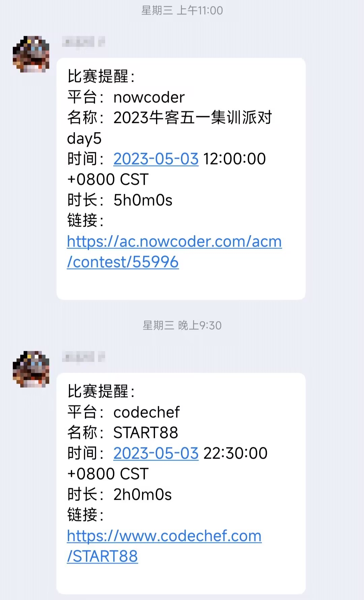

# QQ比赛提醒机器人

## 简介

本项目可以使你的QQ拥有比赛提醒功能。部署即拥有登录和比赛提醒的功能。

## 用法

- 安装[Docker](https://www.docker.com/)
- 修改变量（在`docker-compose.yml`中）
  - SEND_GROUP_ID 表示需要发送比赛提醒的群号（第8行）
  - QQ 表示你的QQ号（第14行）（非常建议使用小号）
  - PASSWORD 填写你的密码（第15行）（可以不填而使用二维码登录）
- 命令行中输入 `docker-compose up -d`
- 稍等片刻，命令行中输入`docker logs $(docker ps -a -q --filter="name=goodguy-qq-reminder-qq")`，获取qq登录情况。（Windows需要使用bash输入这个命令）

如果在使用上出现问题，欢迎在issue中提出。
